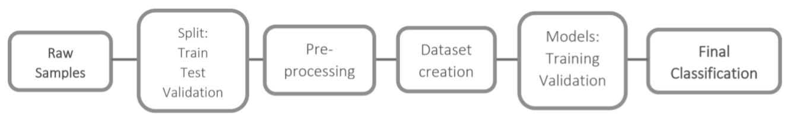
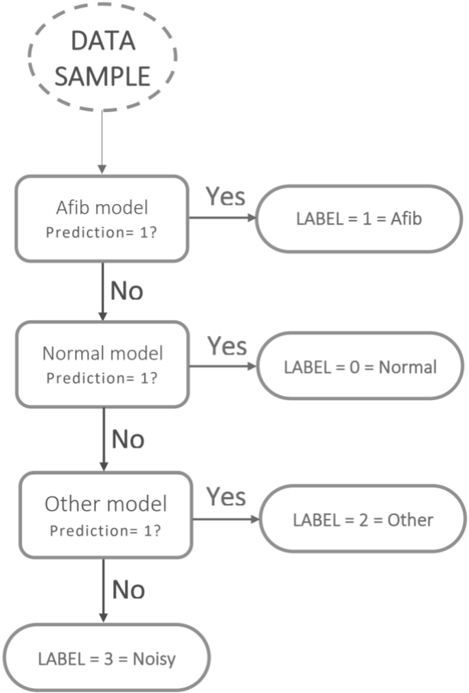
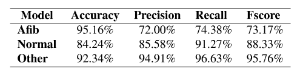

# Multi-class classification from single lead ECG recordings
This is a project made for a *Human Data Analytics* class during a master course in ICT.
  
**Abstract**
>The automatic classification of heart rhythms using
short time single lead ECG recordings is a challenging task that
has been widely studied recently.
In this paper we present our work that aims at classifying these
kind of ECG signals as Atrial Fibrillation (Afib), Normal, Other
rhythms or too noisy to be classified (Noisy). We developed three
different binary classifiers as Recurrent Neural Networks (RNNs)
both with a binary cross-entropy loss function and a weighted
version of it. We used these three RNNs to develop a cascade
classifier for the samples of the given dataset, considering the
problem as a multiple binary classification problem.
We obtained similar results, with a slightly better result using
the unweighted loss function, with an accuracy of 81.18% vs
80.01% and a F1 score of 0.77 vs 0.76.

> 
>Hierarchy of the process blocks. 

> 
>Final classifiers hierarchy.

> 
>Validation performances of the single trainedmodels.

*The final accuracy of our project is 81.18%with a F1 score of 0.77.*

 For the paper, the license used is: <a rel="license" href="http://creativecommons.org/licenses/by-nc-sa/4.0/">Creative Commons Attribution-NonCommercial-ShareAlike 4.0 International License</a>.
